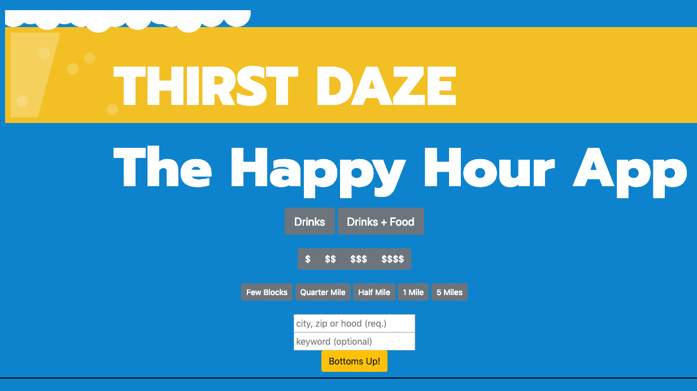

# Project Happy Hour

## ThirstDaze 
 * The Happy Hour Appication that provides a curated list of happy hour or daily drink specials based off your current location. The software looks at dozens of different signals, including various measures of quality, reliability, and activity on the ThirstDaze app.
* In addition to our directory, you can use ThirstDaze to find new experiences, neighborhoods, and to see where your friends are ordering pickle backs. 

* Every business owner or happy hour goer can setup a free account to keep information fresh and up-to- date via crowdsourse.

## OUR PURPOSE IS TO CONNECT YOU WITH THE CLOSEST, COLDEST, AND CHEAPEST BEVERAGE.

* The app uses Firebase to host the data retrieved from the user-input.
* The app also features real-time updates for happy hour specials near you.

## Technologies 
* HTML 
* CSS3 
* Bootstrap V4+ 
* Javascript ES5 
* JQuery library 
* Google Maps API 
* Yelp API 
* Firebase
* Animate CSS

## Development Team
* Fontend: Ryan Zaragoza and Louis Henning
* Backend: Calvin Chau and Carlos Ponce

### Comments
* Beta v0.88 status
* Known compataibility issues with Firefox at the moment
* User submitted data persists to Firebase but feature to display inline with results still WIP
* Styling still WIP
* [Link to live project deployed on Github Pages](https://bavarianstance.github.io/ThirstDaze-Happy-Hour-Search/)

### Screenshot

